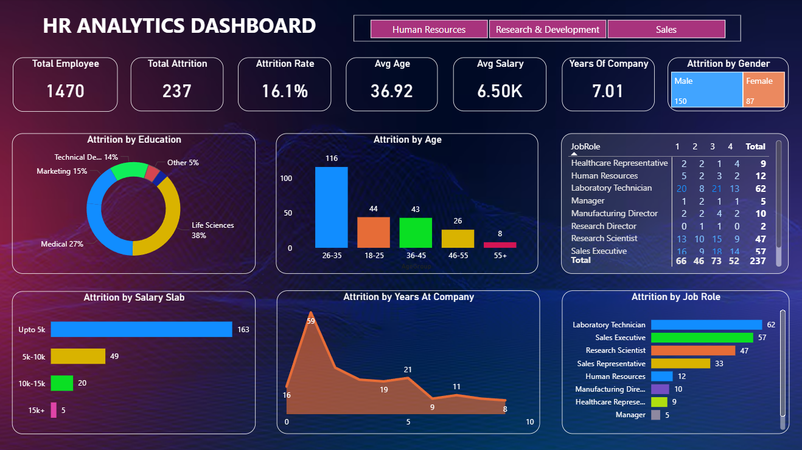

# HR Analytics Dashboard | Power BI

## Project Summary
End-to-end HR analytics solution built in Power BI to analyze employee attrition,
workforce structure, and satisfaction metrics using clean data modeling and
DAX-driven KPIs.

“This project uses PostgreSQL for SQL-based HR attrition analysis and Power BI for interactive visualization and insights.”

---

## SQL Analysis (PostgreSQL)

This project also includes SQL-based HR analytics performed using PostgreSQL to support data exploration and validation before visualization in Power BI.

### SQL Objectives
- Analyze employee attrition using structured queries
- Identify department-wise and role-wise attrition trends
- Evaluate salary and overtime impact on attrition
- Detect high-risk employee segments

### SQL Skills Used
- SELECT, WHERE, GROUP BY, ORDER BY
- Aggregate functions (COUNT, AVG)
- Type casting and filtering logic

📂 All SQL queries are available in the `/sql` folder of this repository.

---

## Skills Demonstrated
- Data cleaning & transformation (Excel)
- Data modeling & relationships
- DAX measure creation
- KPI design for HR analytics
- Interactive dashboard development
- Business insight generation

---

## Core KPIs
- Total Employees
- Attrition Count & Attrition Rate (%)
- Average Monthly Income
- Average Job Satisfaction
- Average Years at Company
- Department & Role-wise Attrition

---

## Technical Execution
- Cleaned and standardized raw HR dataset
- Designed optimized data model for analysis
- Implemented reusable DAX measures
- Built dynamic visuals with slicers & filters
- Focused on performance and clarity

---

## Business Impact
- Identifies high-risk attrition segments
- Supports data-driven retention strategy
- Improves HR decision-making speed
- Replaces manual HR reporting with automation

---

## Dashboard Preview

---

## Scalability
- Can be extended to predictive attrition modeling
- Suitable for real-time HR data integration
- Ready for department-level KPI expansion

---

## Author
Amit Das  
Aspiring Data Analyst | Power BI | Excel | DAX | Data Visualization
